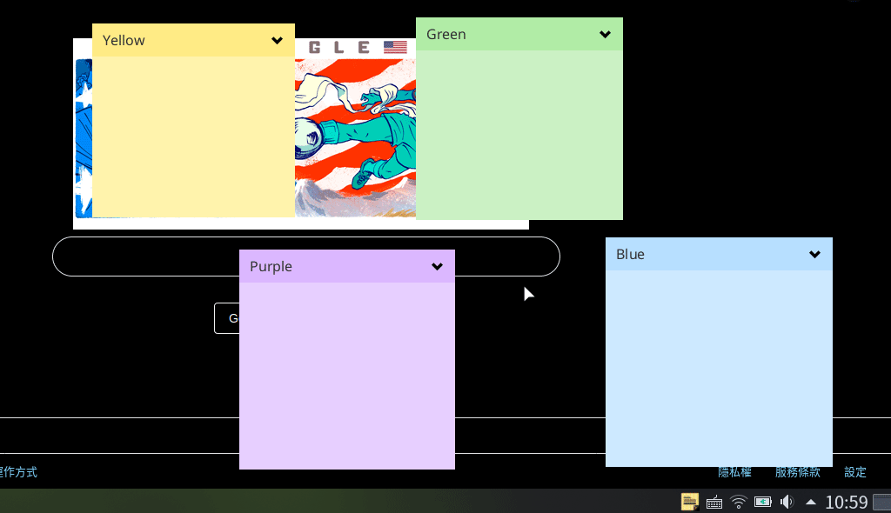

# CrazyNote
### If you like this project, please give me a :star: and I will appreciate you.
   
A sticky note written in Java and Kotlin and use JavaFX WebView to embed a rich text area via JavaScript library.

## Features
- Basic text format   
    
    
    
- Quote   
    
- Code highlight   
    
- Insert image   
    
- Change color   
    
- Show/Hide notes   
    
- Bring to top/bottom   
    

## Download
- Windows(with JRE): [download]()
- Linux(with JRE): [download]()
- Jar file(only support Java 8): [download]()

## Known Issues
I almost test this program on Linux(Ubuntu 18.04), so I can't ensure that the following issues will occur on Windows. I just mark the platform where the issue happens. Please pay attention to it.

- Big image(> 1MB) will slow down the note's movement(Both)
- "Bring All Notes Backwards" sometimes isn't working(Linux)
- When choose a image, the program may crash(Linux)
- The system tray icon's positron is strange(Linux)   
    Correct:   
    Incorrect:
- Chinese fonts may not be applied all formats(Both)   
    
- Starting the program, I see a strange line(Linux)   
    Before:   
       
    After:   
       
    In order to make javaFX stage undecorated and invisible on system's task bar, I make the primary stage very small and locate it beyond the screen. On Windows, the primary stage is completely invisible, but on Linux, the stage is still on screen and becomes a line.
- When indent/unindent the text, the cursor can't follow it immediately(Both)   
    JavaFX doesn't have a rich text area. in this situation, I use a 3rd party JavaScript library Quill via WebView. I'm not sure if it is the library's issue.

## Credit
Icons made by [Kiranshastry](https://www.flaticon.com/authors/kiranshastry) from [Flaticon](https://www.flaticon.com/) is licensed by [CC 3.0 BY](http://creativecommons.org/licenses/by/3.0/)
